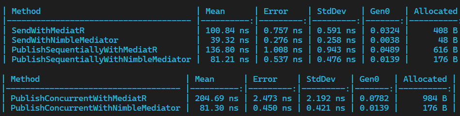

# NimbleMediator

NimbleMediator is a significantly faster, lightweight and memory-efficient mediator pattern implementation for .NET, designed to be an alternative to popular mediator libraries.

## Features

- **Faster Performance**: Designed to offer a speed advantage over similar packages, providing quicker request and notification processing times. (***~2,5*** times faster than MediatR)
- **Less Memory Usage**: optimized to minimize memory allocations, helping to reduce the overall memory footprint. (uses ***~8x*** less memory than MediatR)
- **Easy to Integrate**:  Can be easily integrated into existing .NET projects, offering a simple and similar IMediator, ISender, IPublisher interfacses.
- **Individualized Publish Strategies**:  Allows for different publish strategies for each notification, enabling developers to choose between sequential or concurrent execution based on the specific requirements of their notification handlers.


## Getting Started

### Install
Install the NimbleMediator with ```dotnet add package NimbleMediator``` or via NuGet package manager.

### Configure
Set up NimbleMediator in your ``Startup.cs`` or ``Program.cs`` by utilizing the ``services.AddNimbleMediator()`` method and configuring your handlers and publishers as necessary.

#### Register Handlers
Register your handlers from the assembly:
    
```csharp

    services.AddNimbleMediator(cfg => {
        cfg.RegisterHandlersFromAssembly(typeof(Startup).Assembly);
    });

```

#### Set default publishing strategy
Set the default publishing strategy for all notifications.
It is ``PublishStrategy.Foreach`` by default if you don't set it.

```csharp

    cfg.SetDefaultNotificationPublisherType(PublishStrategy.TaskWhenAll);

```

#### Set an individual publishing strategy for a notification
Even the default strategy is different, you can set an individual strategy for a notification.

```csharp

    cfg.SetNotificationPublisherType<MyRequest1>(PublishStrategy.Foreach);

    cfg.SetNotificationPublisherType<MyRequest2>(PublishStrategy.TaskWhenAll);

```

#### Define Requests and Handlers
Define your requests and handlers as you would with any other mediator library.
Notice that ``ValueTask`` is used instead of ``Task`` to reduce memory allocations in case of synchronus execution based on some condition.


```csharp

    public class MyRequest : IRequest<string> 
    { 
        public string Name { get; set; }
    }

    public class MyRequestHandler : IRequestHandler<Request1, string>
    {
        public ValueTask<string> Handle(Request1 request, CancellationToken cancellationToken)
        {
            // Do some work.

            if(someCondition)
            {
                return request.Name;
            }

            var result = await SomeAsyncTask();

            return result;
        }
    }

```

#### Define Notifications and Handlers
Define your notifications and handlers as you would with any other mediator library.
``ValueTask``'s are not used for Notifications due asynchronous nature of the notifications.

```csharp

    public class MyNotification : INotification 
    { 
        public string Name { get; set; }
    }

    public class MyNotificationHandler : INotificationHandler<MyNotification>
    {
        public Task Handle(MyNotification notification, CancellationToken cancellationToken)
        {

            await SomeAsyncTask();
        }
    }

```

### Performance & Benchmarks

NimbleMediator is backed by Dictionaries to hold type informations etc instead of relying on runtime reflection. This approach provides a significant performance advantage over other mediator libraries.

NimbleMediator is currently approximately **2,5** times faster than MediatR and uses almost **~8x** less memory.



### Contributing

Contributions are welcome! Please feel free to submit a Pull Request. See the [Contributing Guidelines](CONTRIBUTING.md) for more information.

### License
All contents of this package are licensed under the [Apache License 2.0](LICENSE).
