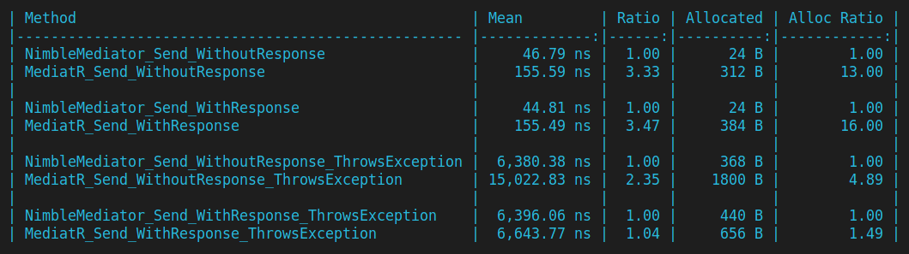
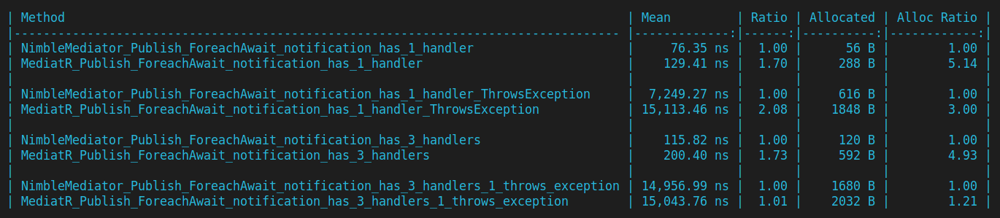
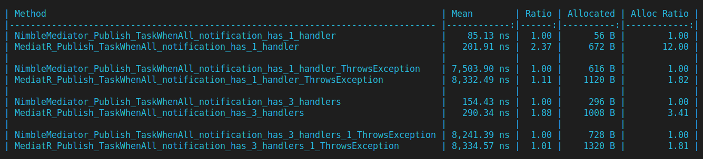

# NimbleMediator

NimbleMediator is a significantly faster, lightweight and memory-efficient mediator pattern implementation for .NET, designed to be an alternative to popular mediator libraries.

## Features

- **Faster Performance**: Designed to offer a speed advantage over similar packages, providing quicker request and notification processing times. (***~3,5*** times faster than MediatR)
- **Less Memory Usage**: optimized to minimize memory allocations, helping to reduce the overall memory footprint. (uses ***~16x*** less memory than MediatR)
- **Easy to Integrate**:  Can be easily integrated into existing .NET projects, offering a simple and similar IMediator, ISender, IPublisher interfacses.
- **Individualized Notification Publishers**:  Allows for different publisher implementations for each notification, enabling developers to have the flexibility to choose the best publisher implementation for each notification. Also supports custom publisher implementations via INotificationPublisher interface.

## Getting Started

### Install
Install the NimbleMediator with ```dotnet add package NimbleMediator``` or via NuGet package manager.

### Configure
Set up NimbleMediator in your ``Startup.cs`` or ``Program.cs`` by utilizing the ``services.AddNimbleMediator()`` method and configuring your handlers and publishers as necessary.

#### Register Handlers
Register your handlers from the assembly:
    
```csharp

    services.AddNimbleMediator(cfg => {
        cfg.RegisterServicesFromAssembly(typeof(Startup).Assembly);
    });

```

or from assemblies:
    
```csharp
    
    services.AddNimbleMediator(cfg => {
        cfg.RegisterServicesFromAssemblies(typeof(X).Assembly, typeof(Y).Assembly, typeof(Z).Assembly);
    });

```

#### Set default publisher (optional)
Set the default publisher implementation for notifications.
It is ``ForeachAwaitRobustPublisher`` by default if you don't set it.

```csharp

    cfg.SetDefaultNotificationPublisher<ForeachAwaitStopOnFirstExceptionPublisher();

```

or 

```csharp

    cfg.SetDefaultNotificationPublisher<TaskWhenAllPublisher>();

```

#### Set default publisher's lifetime (optional)
Set the default publisher's lifetime. It is ``Singleton`` by default if you don't set it.

```csharp

    cfg.SetDefaultNotificationPublisherLifetime(ServiceLifetime.Transient);

```

or 

```csharp

    cfg.SetDefaultNotificationPublisher<ForeachAwaitStopOnFirstExceptionPublisher(ServiceLifetime.Transient);

```

#### Set a different publisher for a particular notification (optional)

```csharp

    cfg.SetNotificationPublisher<MyNotification, TaskWhenAllPublisher>();

```

you can even provide lifetime here:

```csharp

    cfg.SetNotificationPublisher<MyNotification, TaskWhenAllPublisher>(ServiceLifetime.Singleton);

```

##### Default publishers
1. ``ForeachAwaitRobustPublisher``: Executes all handlers in a sequential manner. If any of the handlers throws an exception, it will be caught and will thrown after all handlers are executed. Ensures that all handlers are executed even if one of them throws an exception.

2. ``ForeachAwaitStopOnFirstExceptionPublisher``: Executes all handlers in a sequential manner. If any of the handlers throws an exception, will be caught and be thrown immediately. Stops executing handlers if one of them throws an exception.

3. ``TaskWhenAllPublisher``: Executes all handlers in a concurrent manner. If any of the handlers throws an exception, it will be caught and will thrown after all handlers are executed. Ensures that all handlers are executed even if one of them throws an exception.

##### Custom publishers
You can implement your own publisher by implementing ``INotificationPublisher`` interface.

```csharp

    public class MyOwnCustomPublisher : INotificationPublisher
    {
        public async Task PublishAsync<TNotification>(TNotification notification, IEnumerable<INotificationHandler<TNotification>> handlers, CancellationToken cancellationToken) 
            where TNotification : INotification
        {
            // Implement
        }
    }

```

And set it as default publisher:

```csharp

    cfg.SetDefaultNotificationPublisher<MyOwnCustomPublisher>();

```

Or set it just for a particular notification:

```csharp

    cfg.SetNotificationPublisher<MyNotification, MyOwnCustomPublisher>();

```

#### Define Requests and Handlers
Define your requests and handlers as you would with any other mediator library.
Notice that ``ValueTask`` is used instead of ``Task`` to reduce memory allocations in case of synchronus execution based on some condition.


```csharp

    public class MyRequest : IRequest<string> 
    { 
        public string Name { get; set; }
    }

    public class MyRequestHandler : IRequestHandler<MyRequest, string>
    {
        public ValueTask<string> Handle(Request1 request, CancellationToken cancellationToken)
        {
            // Do some work.

            if(someCondition)
            {
                return "NimbleMediator";
            }

            var result = await SomeAsyncTask();

            return result;
        }
    }

```

#### Define Notifications and Handlers
Define your notifications and handlers as you would with any other mediator library.
``ValueTask``'s are not used for Notifications due asynchronous nature of the notifications.

```csharp

    public class MyNotification : INotification 
    { 
        public string Name { get; set; }
    }

    public class MyNotificationHandler : INotificationHandler<MyNotification>
    {
        public Task Handle(MyNotification notification, CancellationToken cancellationToken)
        {

            await SomeAsyncTask();
        }
    }

```

### Performance & Benchmarks

NimbleMediator is directly depends DI container to get handlers instead of relying on runtime reflection. This approach provides a significant performance advantage over other mediator libraries.

NimbleMediator is currently **3,5** times faster and uses **16x** less memory than MediatR in some cases.








### Contributing

Contributions are welcome! Please feel free to submit a Pull Request. See the [Contributing Guidelines](CONTRIBUTING.md) for more information.

### License
All contents of this package are licensed under the [Apache License 2.0](LICENSE).
